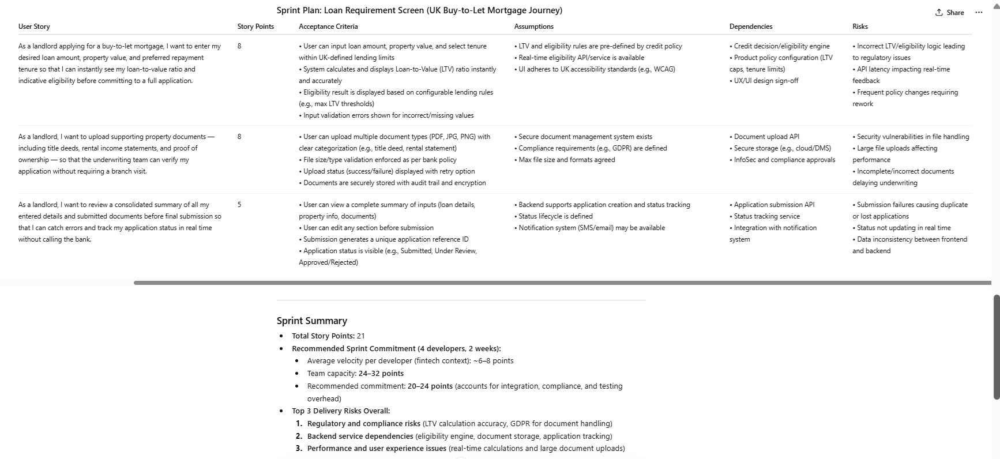

# AI Sprint Planner — Prompt Engineering Artifact

Built by Madhuri Bisht | Technical Project Manager | PMP | PSM I  
Part of my AI-Augmented Delivery Portfolio — github.com/madhuribisht-dev

---

## Problem It Solves

Sprint planning in banking and financial services is time-consuming and inconsistent. Teams spend hours estimating story points, defining acceptance criteria, and identifying risks — often missing compliance-related blockers or API dependencies entirely because the conversation runs long and focus drifts.

This tool uses a structured prompt to generate a first-draft sprint plan in under 60 seconds. The PM reviews, corrects, and refines — but starts from a populated baseline rather than a blank page. It compresses 2-3 hours of prep work into a 5-minute exercise, and the team walks into sprint planning with something to react to rather than something to invent from scratch.

---

## How It Works

Input: Project context and user stories provided by the BA or Product Owner after requirements workshops.  
Process: A structured prompt is sent to an LLM — tested on both Claude and ChatGPT.  
Output: A sprint plan table covering story points, acceptance criteria, assumptions, dependencies, and risks per story — plus a sprint summary with capacity recommendation and the top delivery risks overall.

The PM is not removed from the process. The AI produces a draft. The PM validates it against team context, corrects where needed, and uses it to facilitate a sharper, faster planning session.

---

## User Stories Used

These are written for a buy-to-let mortgage product in a UK banking context.

1. As a landlord applying for a buy-to-let mortgage, I want to enter my desired loan amount, property value, and preferred repayment tenure so that I can instantly see my loan-to-value ratio and indicative eligibility before committing to a full application.

2. As a landlord, I want to upload supporting property documents — including title deeds, rental income statements, and proof of ownership — so that the underwriting team can verify my application without requiring a branch visit.

3. As a landlord, I want to review a consolidated summary of all my entered details and submitted documents before final submission so that I can catch errors and track my application status in real time without calling the bank.

---

## The Prompt

```
You are an experienced Agile Practitioner and Project Manager
with expertise in sprint estimation and delivery planning
for banking and financial services products.

Here is the project context:
We are designing a new sales journey for landlords applying
for buy-to-let mortgages. The feature is: Design the new
Loan Requirement Screen for a UK retail banking product.

Here are the user stories:

1. As a landlord applying for a buy-to-let mortgage, I want
   to enter my desired loan amount, property value, and
   preferred repayment tenure so that I can instantly see
   my loan-to-value ratio and indicative eligibility before
   committing to a full application.

2. As a landlord, I want to upload supporting property
   documents — including title deeds, rental income
   statements, and proof of ownership — so that the
   underwriting team can verify my application without
   requiring a branch visit.

3. As a landlord, I want to review a consolidated summary
   of all my entered details and submitted documents before
   final submission so that I can catch errors and track my
   application status in real time without calling the bank.

For each user story, generate a structured sprint plan with
these exact columns:
- User Story
- Story Points (use Fibonacci: 1, 2, 3, 5, 8)
- Acceptance Criteria (minimum 3 testable bullet points)
- Assumptions
- Dependencies
- Risks

Output as a clean formatted table. After the table, add a
Sprint Summary section covering: total story points,
recommended sprint commitment for a team of 4 developers
over 2 weeks, and top 3 delivery risks overall.
```

---

## Sample Output



---

## Critical Evaluation — What I Corrected

The model estimated team capacity at 32-40 story points for 4 developers over a 2-week sprint. This figure is too high for a banking delivery context and would lead to over-commitment.

What the model did not account for:

- Sprint ceremonies — planning, daily standups, review, and retrospective — consume roughly 15-20% of available developer time
- Compliance and security review cycles in regulated banking environments add review overhead that does not appear in the backlog but consumes sprint capacity
- Integration dependencies, particularly on eligibility calculation APIs and document storage services, introduce waiting time that reduces effective coding time

Corrected capacity: 6-7 story points per developer is realistic in this context, giving a team total of 24-28 points. Committing to 18 points for this sprint is deliberately conservative and appropriate given that three of the key APIs — eligibility engine, document upload, and submission service — have not yet confirmed readiness.

This is the core judgment call an AI-augmented delivery manager makes: reading the output critically, applying domain knowledge, and correcting where the model lacks context.

---

## How a Delivery Team Would Use This

The BA and PO write user stories following the requirements workshop. Before the sprint planning session, the PM feeds those stories into this prompt. The AI returns a structured draft within 60 seconds. The PM reviews the output — adjusting estimates where team context differs, validating risks against known project constraints, and correcting capacity assumptions based on the actual team's velocity and sprint overhead.

The team enters the planning session with a working document to review rather than starting from zero. In practice this reduces planning ceremony time from 2-3 hours to under 90 minutes and produces a more consistent, auditable planning output.

---

## Part of My AI Delivery Portfolio

| Artifact | What It Does |
|---|---|
| AI Sprint Planner — this repo | Converts user stories into a structured sprint plan |
| AI RAID Log Generator | Converts a project brief into a populated RAID log |
| AI Status Report Summarizer | Converts raw team updates into a formatted RAG status report |

---

## About

Madhuri Bisht is a Technical Project Manager with 11+ years of delivery experience in Banking, Telecom, and Travel domains across India and the UK. She holds PMP, PSM I, AZ-900, and Google Project Management certifications and is currently building an AI-augmented delivery practice.

Portfolio: https://madhuribisht-dev.github.io  
LinkedIn: https://linkedin.com/in/madhuri-bishtkaira/
